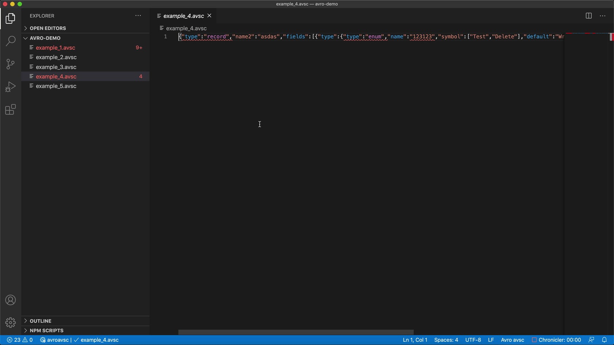

# avro-tools

This is an extension to validate Avro schema in `.avsc` files. It does schema highlighting using TextMate engine. It contains field snippets and auto formatting.

## Features

Currently it does syntax highlighting.

It includes snippets for adding fields with types.

It does formatting.

Validation:
* file is in JSON format
* union default value is matching first type
* attributes have correct types
* attributes are not duplicated
* types have all required attributes
* logical types are matching type and have all attributes set correctly
* names, namespaces and enum symbols are in correct format

## Requirements

It requires VS Code in version at least 1.48.0

## Extension Settings

This extension doesn't use settings.

## Known Issues

* Tolerance to invalid syntax is very low

## Planned Features

* Validate duplicated names for fields
* Validate if enum symbols are unique
* Validate text separators ("}", "]", ":", "," but syntax tree building is causing entire document to go read on missing closing bracket when attribute had value, that could be added)
* Validating keys available in Avro (Based on documentation other keys are correct " Attributes not defined in this document are permitted as metadata, but must not affect the format of serialized data. ") Maybe configurable strict validation to only expect AVRO fields
* Validating values in array
* Autocomplete of keys, types, defaults

## Release Notes

No releases yet